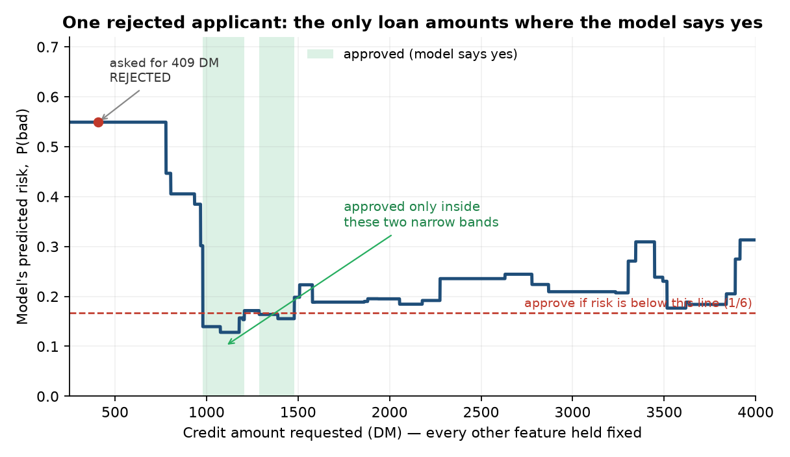

I audited a credit-scoring model against the EU AI Act. The result I keep coming back to has nothing to do with accuracy or fairness. It is this: a handful of the applicants the model rejected could only have been approved by asking for *more* money. That is a flaw in the model, not advice anyone could act on.

One applicant makes the point on their own. They asked for a loan of 409 Deutsche Mark (the data is early-1990s German bank records) and were rejected. Hold everything else about them fixed, slide the requested amount up and down, and watch what the model does:

There is no coherent advice you could give this person. Smaller loans are rejected, so "borrow less" is out. Most larger loans are rejected too. The only route to a yes is to land inside one of two arbitrary green slivers, and nothing about the applicant explains where those slivers fall. No loan officer would ever say it. The model would, for four of the people it turned down.

> **The finding, in four lines**
> - **What:** 4 of the 19 applicants that no smaller or shorter loan could rescue flip to approved by asking for a bigger one.
> - **Why it matters:** the obvious advice to give them, "reduce your loan," is exactly backwards.
> - **How I caught it:** an exhaustive grid over every smaller or shorter loan, then a probe the opposite way on the cases no reduction could fix.
> - **Deployer action:** investigate as model risk; keep it out of customer-facing advice.

## The setup

The model is a LightGBM classifier trained on the German Credit dataset, with a test AUROC of 0.769. LightGBM is a gradient-boosted tree ensemble, widely used for tabular credit data. Any single tree would be readable; the full ensemble is a black box, which makes its explanations and its recourse worth auditing. I scored it at a cost-sensitive 5:1 threshold, the setting that treats approving a bad loan as five times worse than turning away a good one. This is the high-risk credit scoring that Annex III of the EU AI Act now covers.

I built it and I audited it. That makes this a self-assessment, not an independent audit, and I will come back to why the difference is load-bearing. Everything is public and pre-registered: https://github.com/Desmond-Mariita/eu-ai-act-credit-assurance.

## Recourse, and where it ran backwards

Recourse asks what a rejected applicant would have to change to get an approval. For a loan model the actionable answers are a shorter term or a smaller amount, so I searched every valid combination of loan duration and credit amount below what each applicant asked for, and scored each one against the frozen, hash-pinned model.

| Of the 151 rejected applicants… | Count | Share |
|---|---:|---:|
| reach approval with a smaller or shorter loan | 132 | 87.4% |
| cannot: no smaller or shorter loan works | 19 | 12.6% |
| &nbsp;&nbsp;→ but approved if they ask for a *bigger* loan | 4 | |
| &nbsp;&nbsp;→ genuinely stuck: no single change works | 15 | |

So 87.4% of the rejected applicants have a way back to approval through a smaller or shorter loan, more often a shorter term than a smaller amount. When a bank declines a loan it owes the applicant a reason for the decision, and banks call these "reason codes." Across the declined applicants the most-cited reason is **loan duration** (100 times), with **credit amount** next (59). That is the kind of explanation a deployer can defensibly hand a customer.

Then there is the other 12.6%, the 19 people no reduction can help. Here is a mistake worth putting on the record. My first write-up said those 19 rejections "rest on non-actionable factors" like credit history or account status, the things an applicant cannot change on a form. It sounded reasonable. It was also an overclaim: all I had shown was that no *reduction* worked. I had said nothing about *why*.

Searching the other direction broke that story. Four of the 19 were not blocked by an immutable trait, by something fixed like credit history that an applicant cannot change. They flip to approved by requesting a larger loan:

| Requested (DM) | Approved once they ask for | Model's original risk |
|---:|---:|---:|
| 409 | 980 | 0.55 |
| 652 | 3,516 | 0.73 |
| 741 | 3,516 | 0.77 |
| 959 | 3,516 | 0.63 |

A monotone model would push predicted risk in one steady direction as the loan grows. This one does not: for these four applicants, more credit means lower predicted risk. And it is specifically the size of the loan: a longer repayment term flipped none of them, only a larger sum. Stranger still, three of them cross into approval at exactly 3,516 DM. That is a fingerprint of the model's geometry; nothing obvious about the three applicants explains it. A boosted tree ensemble predicts in steps, changing its mind only at the split points it learned from the data, so different applicants get funnelled to the same handful of amounts. I had been one edit away from publishing a causal claim the data did not support.

> **If you deploy a model like this:** the four increase-flip cases are model risk, not recourse, so flag them for review. And search in *both* directions before you trust a "no recourse" result, because a one-way search quietly relabels non-monotonicity as immutability.

I did not get here with an off-the-shelf tool. My first attempt used a popular counterfactual library, which proposed loans of 13.1 months and other fractions no bank offers. I threw it out and built the integer grid instead. That library is not the villain. A search that fails to find a counterfactual and a case where none exists look identical from the outside, and for an audit that gap is the whole job.

## The rest of the audit, briefly

The borrow-more result is the one that surprised me most, but it is not the whole audit.

On fairness, the disparities run the wrong way: women and younger applicants are declined more often. None of it clears significance on a 300-row test set (sex false-positive-rate difference, permutation test p = 0.091). I will not call that "no bias." The model trains directly on a sex proxy, age, and foreign-worker status, and 300 rows is too few to rule out a real gap. These are monitoring flags, not a clean bill of health.

On robustness, 13.3% of applicants sit within a hair of the decision threshold, where small synthetic input noise flips their result. The core faithfulness result also replicated on a second, structurally different dataset, Give Me Some Credit; recourse I tested only on German Credit.

## Why you can believe any of this

Any of this only counts if you can trust that the audit produced it honestly, and self-assessment is where that trust runs thinnest. The recourse result comes from an exhaustive, direction-constrained search over a frozen, hash-verified model. Because the search checks every candidate rather than sampling, there is no stochastic solver whose randomness I could have quietly steered toward a nicer number. And I committed the hypotheses and the method to a signed, timestamped record before running anything, anchored to a public blockchain block, so I could not have moved the goalposts after seeing the results.

I also got things wrong on the record. The "non-actionable factors" overclaim above is one of them. I put the whole audit through a panel of separate AI models, each prompted to attack it; they caught a real bug (an explanation method quietly sampling impossible applicants) and several softer overstatements, which I fixed across versions. I re-cut a release tag once, early on, before I learned that you do not move a published tag. Since then I supersede rather than move. That review is quality control, not independent human assurance, and I say so in every document. Confusing the two would undercut the whole point of the project.

## What it does not claim

This is not a statement that the model is EU AI Act compliant. It is a self-assessment of four testable properties. The obligations that need a real deployment are listed as open gaps: a quality management system, production logging, post-market monitoring, and a real Data Protection Impact Assessment (the privacy review GDPR requires before high-risk processing). The missing piece is an independent human reviewer, someone who built neither the model nor the audit. That is the distance between "I checked my own work carefully" and "someone qualified checked it," and I am not going to paper over it.

Consider this an open invitation. If you have the background to judge this work (machine learning, statistics, the EU AI Act, or GDPR) and you had no hand in building it, I would like you to review it. The repo ships a structured reviewer template for exactly this, and I will publish your signed verdict in full, including anything it gets wrong. An audit that no independent expert has checked still needs that review before anyone treats it as independent assurance.

## One more thread

When I stopped asking whether the model's *decisions* were sound and started asking whether its *explanations* were faithful, whether SHAP and LIME actually described what the model was doing, the honest answer turned out to be "it depends on how you measure." One of the most popular explanation tools was the source of those impossible applicants. If you want the technical teardown, I wrote it up separately: [Part 2](../faithfulness/index.qmd).

The repo, the signed audit opinion, and the full evidence trail are here: https://github.com/Desmond-Mariita/eu-ai-act-credit-assurance. I am moving into AI assurance and governance work. If this is the kind of work your team needs done, with this level of traceability, I would like to hear from you.

*Prefer a typeset copy? [Download the PDF](article-part1-borrow-more.pdf).*
